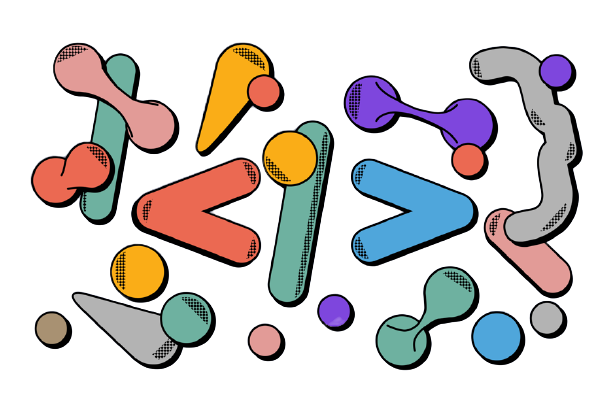

### Hello,I'm Kadir Demirel 👋

 

## Skills,Expereince and Tools

  

 

#

#
## Latest Blog Posts
✍️ <a href="https://medium.com/@kadirdemirell/elementler-md-f6c7228f041c"  style="max-width:100%;">Elementler</a>  
✍️ <a href="https://medium.com/@kadirdemirell/dillinger-md-b8facabc1dd5"  style="max-width:100%;">JSX'e Giriş</a>  
✍️ <a href="https://medium.com/@kadirdemirell/react-nedir-28beb7153845"  style="max-width:100%;">React Nedir?</a>  
✍️ <a href="https://medium.com/@kadirdemirell/ubuntu-b61700a379dc"  style="max-width:100%;">Ubuntu</a>  
✍️ <a href="https://medium.com/@kadirdemirell/nedir-bu-javascript-4d57404d4e1c"  style="max-width:100%;">Nedir Bu JavaScript?</a>    
👉️ <a href="https://medium.com/@kadirdemirell"  style="max-width:100%;">Stay Tuned For More</a>
#
 

